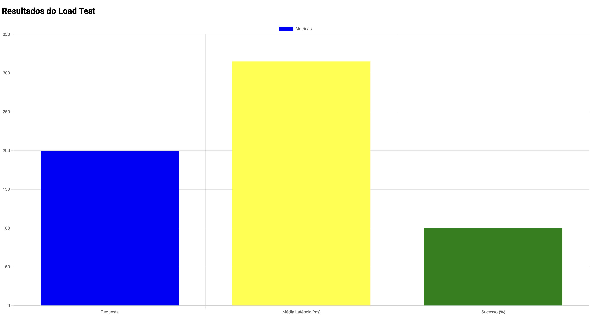

# Desafio Load Test 

Ao executar o comando, a aplicação realizará um teste de carga (load test) com base nos parâmetros fornecidos através da interface de linha de comando cobra (CLI). Durante o processo, a aplicação simulará requisições para o serviço especificado, conforme as configurações definidas para o número total de requisições e a concorrência.

Após a conclusão do teste, o resultado será exibido no console, fornecendo uma visão detalhada sobre a performance do serviço. Além disso, um relatório em formato HTML será gerado, apresentando os dados do teste de forma visualmente atraente e interativa. O gráfico incluído no relatório é gerado utilizando a biblioteca Chart.js, proporcionando uma visualização clara e dinâmica dos resultados.

O arquivo result.html será automaticamente aberto no navegador padrão, permitindo ao usuário visualizar imediatamente os resultados em um formato de fácil compreensão.


---
### **Importante:**
O arquivo só irá abrir automaticamente ao rodar o projeto local, ao rodar via docker só será gerado o arquivo, pois não possui as permissões e libs pra abrir o arquivo no browser.

---


```bash
    # buildar imagem via docker-compose
    docker-compose up -d

     # rodar o comando docker para executar a imagem.

    docker run pos-go-stress-test-loadtest:latest --url=http://google.com --requests=200 --concurrency=20
```



